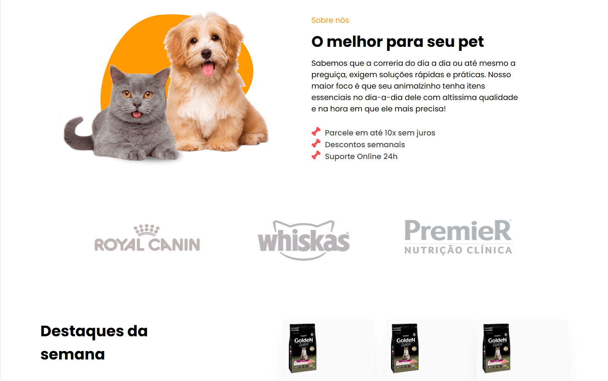
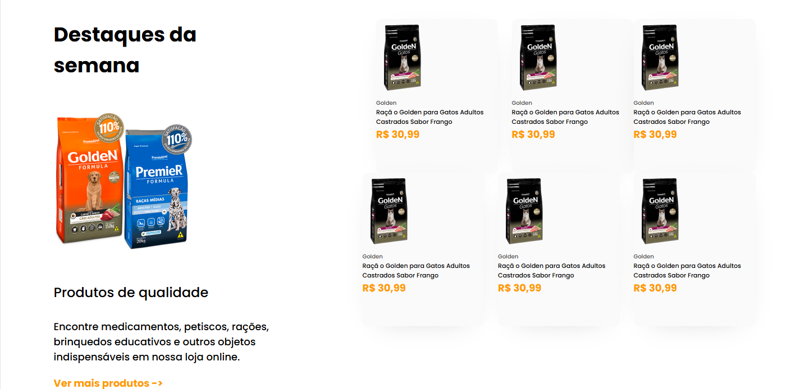
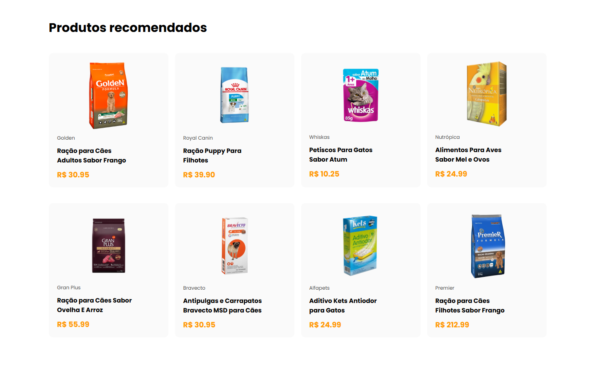

# 🐾 PetFood

**PetFood** é um site fictício de alimentos para pets, criado com **HTML e CSS puro**, com foco em uma apresentação visual agradável e intuitiva. O projeto simula a página principal de uma loja ou serviço voltado para alimentação saudável de cães e gatos.

---

## 🍖 Funcionalidades da Página

- Destaque para produtos e categorias
- Estilo visual moderno e amigável

---

## 🖼️ Preview

---

## 💻 Tecnologias Utilizadas

- HTML5  
- CSS3 (com uso de Flexbox e estilização personalizada)

---

